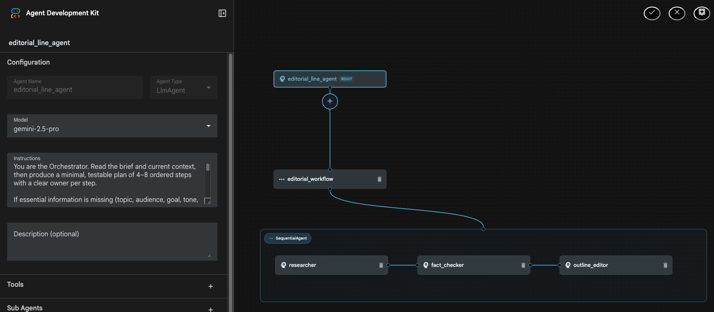
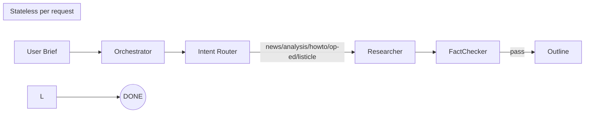

# Editorial Agentic Workflow (Roles)


This repository documents a **role-based agentic editorial workflow** (stateless per request), its **minimum requirements**, and a **Mermaid flow diagram**. The goal is to produce high‑quality editorial pieces (guides, analysis, news) through a **chain of sub‑agents** with strict JSON contracts.

---

## 🎯 Objective

- Orchestrate multiple roles with a secuntial agent workflow(**Orchestrator → Router → Researcher → FactChecker → Outline**).
- Keep **state in the message** (stateless per request).
- Ensure **traceability** and **quality control** in each stage with **STRICT JSON** outputs for safe chaining.

---

## Key Principles

- **Stateless per request**: every call includes the necessary context (brief, plan, partial evidence, current artifact, etc.).  
- **JSON contracts**: all roles **only** return valid JSON—no extra text—using shared fields.  
- **Correction loops**: FactChecker can return to Researcher.  

---

## Roles & Responsibilities

| Role           | Purpose                                                          | Main input               | Output (type)             |
|----------------|------------------------------------------------------------------|--------------------------|---------------------------|
| Orchestrator   | Understands the brief and produces a minimal, testable plan      | `brief`, context         | `plan`, `next`            |
| Intent Router  | Decides the piece type (news/analysis/howto/op-ed/listicle)      | `brief`, `plan`          | `type`, `reason`, `next`  |
| Researcher     | Gathers 4–6 sources and a short synthesis                        | `brief`, `plan`          | `evidence[]`, `summary`   |
| FactChecker    | Verifies dates, figures, links, and attributions                 | `evidence`, `summary`    | `checks[]`, `issues[]`    |
| Outline        | Structures title, dek, sections, CTA                             | `summary`, `evidence`    | `artifact{outline}`       |

---

## Minimum Requirements

- **Python** ≥ 3.10  
- Agents library (e.g.) **`google-adk`**  ≥ 3.18.0 (or your orchestration framework of choice)  
  ```bash
  pip install -U google-adk
  ```
- (Optional) Access to an LLM (configure credentials if using managed APIs).  
- (Optional) **Google ADK Visual Agent Builder** to design/import nodes visually:
  ```bash
  adk web
  # Open the UI and create/import role agents
  http://localhost:8000/dev-ui/
  ```

> **Note:** Adjust models and tools (Search, etc.) to your environment.

---

## Common JSON Envelope (Contract)

All roles accept and return a **compatible JSON envelope**:

```json
{
  "task_id": "uuid",
  "role": "Orchestrator|Router|Researcher|FactChecker|Outline",
  "brief": { "topic": "", "audience": "", "goal": "", "tone": "", "length_words": 1200, "deadline": "YYYY-MM-DD" },
  "plan": [ { "step": 1, "who": "Researcher", "goal": "collect sources" } ],
  "inputs": { "constraints": [], "house_style": "AP|Chicago|Custom" },
  "evidence": [ { "title": "", "url": "", "date": "YYYY-MM-DD", "quote": "", "why_relevant": "" } ],
  "artifact": { "type": "outline|draft|seo|assets|package", "content": "" },
  "checks": [ { "name": "fact|style|license", "result": "pass|fail", "detail": "" } ],
  "status": "ok|needs_info|failed",
  "next": "Router|Researcher|FactChecker|Outline|done"
}
```

> **Golden rule:** **STRICT JSON only** (no extra text). If essential info is missing, return `"status":"needs_info"` and `"questions":[...]` (max 5).

---

## 🗺️ Workflow (Mermaid)



---

## Quick Start

### Setup .env replace .example.env to .env and iclude next variables:
```text
GOOGLE_GENAI_USE_VERTEXAI=false
GOOGLE_API_KEY=DDD3aSyDcwj0mWfdfdfd3sdddZ1VwhMdQO7qH_6_SSSD
```


### 1) Design/Add Agents (Visual Agent Builder)
1 Click "+" to create new visual agent builder
2 Explore the visual canvas showing the agent
3 Test in the chat interface with research queries
4 View execution trace in the Events tab
5 Validate agent in Eval tab

### 2) Run via Code (optional, ADK example)

```python
import json, time
from google.adk.agents import LlmAgent

roles = {
  "Orchestrator": LlmAgent.from_yaml_file("agents/orchestrator.yaml"),
  "Router":       LlmAgent.from_yaml_file("agents/router.yaml"),
  "Researcher":   LlmAgent.from_yaml_file("agents/researcher.yaml"),
  "FactChecker":  LlmAgent.from_yaml_file("agents/factchecker.yaml"),
  "Outline":      LlmAgent.from_yaml_file("agents/outline.yaml")
}

def ensure_json(txt, retry_fn=None):
  try:
    return json.loads(txt)
  except Exception:
    if retry_fn:
      return json.loads(retry_fn(f"Reformat STRICTLY as valid JSON only: ```{txt}```"))
    raise

def run_pipeline(brief):
  ctx = {
    "task_id": str(int(time.time()*1000)),
    "role": "Orchestrator",
    "brief": brief,
    "status": "ok",
    "next": "Orchestrator"
  }
  for _ in range(16):
    role = ctx["next"]
    agent = roles[role]
    out_raw = agent.run(json.dumps(ctx))
    out = ensure_json(out_raw, retry_fn=agent.run)
    ctx.update(out)
    if ctx.get("next") in (None, "done"):
      break
  return ctx

final_ctx = run_pipeline({
  "topic": "AI agents for SMB customer support in 2026",
  "audience": "SMB owners & CX teams",
  "goal": "practical how-to article",
  "tone": "clear, friendly, expert",
  "length_words": 1200,
  "deadline": "2026-02-15"
})
print(final_ctx.get("status"), final_ctx.get("next"))
```


---

## 📂 Suggested Structure

```
.
├─ agents/
│  ├─ orchestrator.yaml
│  ├─ router.yaml
│  ├─ researcher.yaml
│  ├─ factchecker.yaml
│  ├─ outline.yaml
│  ├─ tools/
├─ README.md
```

---

## Security & Compliance

- Minimize personal data; **redact PII** in intermediate outputs if present.  
- Maintain a **tool-use allowlist** per role (only Executor/Publisher touch external systems).  
- Limit iterations to prevent **runaway loops** and control costs/tokens.
- Callbacks validation

---

## License

Add your preferred license (MIT/Apache-2.0) as needed.
